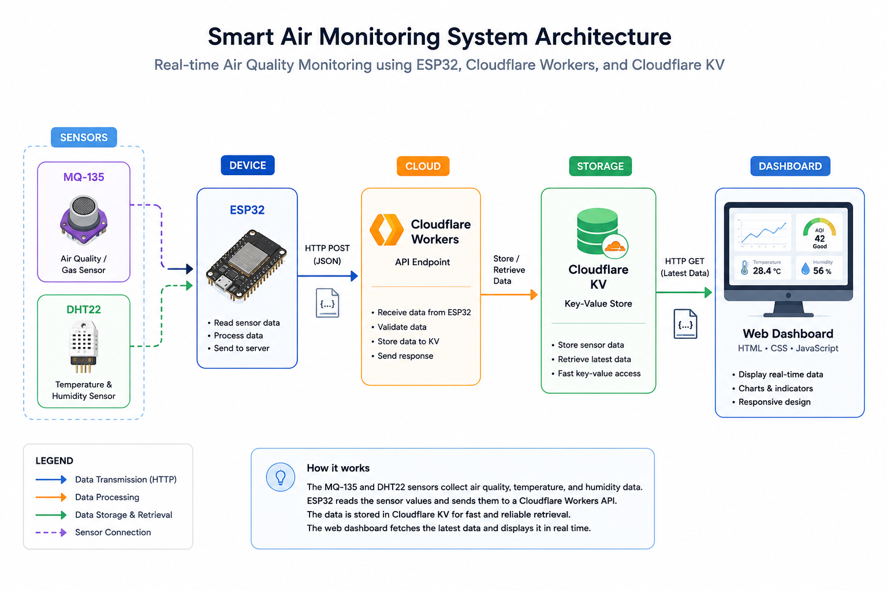

# 🌱 Smart Air Monitoring System

An IoT-based real-time air quality, temperature, and humidity monitoring system using ESP32 and cloud-based edge infrastructure.

[](https://smart-air-monitor-dashboard.pages.dev/)
[](https://github.com/Virnara/smart-air-monitoring)


---

## ✨ Overview
**Smart Air Monitoring System** is an IoT project designed to monitor ambient air quality and environmental conditions in real time. 

Using an ESP32 microcontroller, the system collects data from sensors, processes threshold logic locally to activate hardware alerts, and securely transmits structured JSON data to Cloudflare's serverless edge infrastructure. This project focuses on efficient network handling, memory-safe data processing, and proper hardware safety circuits.

---

## 🚀 Features
- **Real-Time Data Acquisition:** Continuous logging of air pollution levels (smoke/gas) alongside ambient temperature and humidity metrics.
- **Non-Blocking Timer Execution:** Uses `millis()` routines to manage sensor sampling, local alarms, and cloud transmission concurrently without freezing the code execution thread.
- **Emergency Cloud Trigger:** Instantly bypasses the standard 15-second update interval to push data to the cloud the exact moment gas levels cross the safety threshold.
- **Hardware Protection Circuit:** Utilizes a dedicated NPN transistor switch circuit to isolate the buzzer's inductive load and prevent microcontroller GPIO degradation.
- **Automatic WiFi Reconnection:** Native network state tracking that handles reconnection automatically if the local Wi-Fi connection drops.
- **Memory-Efficient String Formatting:** Uses `snprintf()` instead of dynamic String concatenation to prevent heap fragmentation and runtime memory leaks.

---

## 📡 System Architecture
The diagram below illustrates how sensor data flows from the embedded hardware to the cloud infrastructure and finally to the web dashboard.



---

## 🔌 Wiring Diagram
Detailed schematic mapping out the connections between the ESP32, sensors, LEDs, and the transistor-driven buzzer circuit.


### Pin Assignment Matrix
| Component | Physical Pin | Target Node / GPIO | Technical Specification |
| :--- | :--- | :--- | :--- |
| **MQ-135 Gas** | Analog Out (AO) | `GPIO 34` | Routed via voltage divider step-down (~3.3V max input). |
| **DHT22 Sensor** | Data Pin | `GPIO 4` | Connected to 3.3V power rail; digital single-bus protocol. |
| **LED Green** | Anode (+) | `GPIO 27` | Protected by $220\text{ }\Omega$ inline current-limiting resistor. |
| **LED Red** | Anode (+) | `GPIO 26` | Protected by $220\text{ }\Omega$ inline current-limiting resistor. |
| **2N2222 BJT** | Base (B) | `GPIO 25` | Driven through $1\text{ k}\Omega$ resistor; acts as a low-side saturation switch. |
| **Active Buzzer** | Cathode (-) | Transistor Collector | Collector-Emitter loop acts as an isolated ground break. |

---

## 🛠 Tech Stack Matrix

| Category | Technology / Tool | Specification / Usage |
| :--- | :--- | :--- |
| **Microcontroller** | ESP32 | Main Node Processor (Dual-Core SoC) |
| **Programming Language** | Arduino C++ | Embedded Firmware Architecture |
| **Development IDE** | Arduino IDE 2.x | Compilation and Deployment Environment |
| **Core Libraries** | `WiFi.h`, `HTTPClient.h`, `DHT.h` | Networking Stack and Sensor Drivers |
| **Cloud Infrastructure** | Cloudflare Workers | Serverless Gateway API HTTP POST Router |
| **Edge Database** | Cloudflare KV | High-speed Key-Value Engine for Latest State |
| **Front-End Dashboard** | HTML5, CSS3, JavaScript | Web Data Visualization Panel |
| **Web Hosting** | Cloudflare Pages | Static Front-End Application Cloud Hosting |

---

## 📂 Project Structure
```text
smart-air-monitoring/
├── assets/
│   └── images/
│       ├── architecture.png
│       ├── preview.png
│       ├── prototype.jpg
│       └── wiring.png
├── src/
│    ├── cloudflare-
│    │   ├── schema.sql
│    │   └── worker.js
│    ├── esp32/
│    │   └── smart_air_monitor.ino
│    └── web-dashboard/
│        ├── index.html
│        ├── script.js
│        └── style.css
└── README.md
