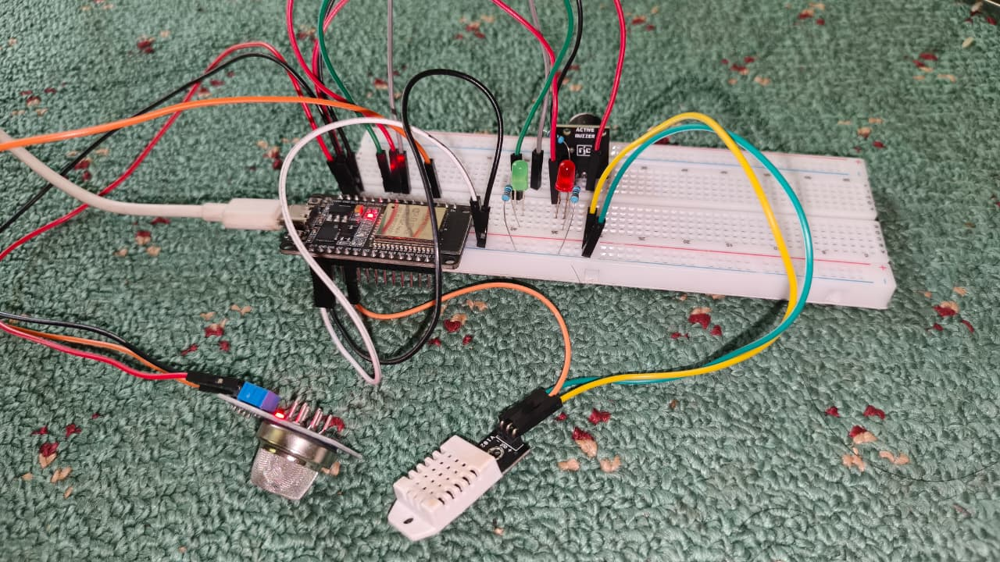

# 🌱 Smart Air Monitoring System

An IoT-based real-time air quality and climate monitoring system powered by ESP32, integrating edge computing infrastructure for instant hazard alerts.

[](https://github.com/Virnara/smart-air-monitoring)


---

## 📸 Preview

*(Note: Visual documentation of the hardware setup and system dashboard)*

---

## ✨ Overview
**Smart Air Monitoring System** is a production-grade Internet of Things (IoT) project designed to measure ambient air pollution and micro-climate changes simultaneously. 

By leveraging the dual-core processing capability of the ESP32, the system handles multi-sensor data acquisition, executes automated safety feedback loops locally, and securely transmits lightweight structured payloads to serverless edge infrastructure. The hardware architecture incorporates explicit current-limiting and logic separation standards to ensure embedded system longevity.

---

## 🚀 Features
- **Dual-Sensor Data Acquisition:** Real-time logging of gas concentration (pollutants/smoke) alongside precision temperature and relative humidity metrics.
- **Non-Blocking Execution Loop:** Implements advanced `millis()` timing routines to manage local sensor queries, multi-rate visual blink notifications, and cloud telemetry concurrently without thread freezing.
- **Instant Emergency Trigger:** Automatically bypasses standard cloud transmission intervals to push immediate emergency payloads the exact moment air quality crosses the safety threshold.
- **Industrial Hardware Protection:** Utilizes dedicated NPN switching circuitry to isolate inductive back-EMF feedback, protecting the microcontroller's GPIO from structural degradation.
- **Robust Network Auto-Recovery:** Native WiFi state tracking that forces automatic reconnection routines if access points experience unexpected downtime.
- **Memory-Optimized Telemetry:** Replaces high-overhead dynamic string concatenations with deterministic `snprintf` C-style string tokenization to eliminate runtime heap fragmentation.

---

## 🛠 Hardware Architecture

### Components & Microcontroller
- **Main Controller:** ESP32 Development Board (32-bit SoC, Integrated Wi-Fi).
- **Gas Sensor:** MQ-135 Air Quality Sensor (Sensitive to Smoke, $CO_2$, and toxic gases).
- **Climate Sensor:** DHT22 (AM2302) Relative Humidity & Temperature Sensor.
- **Visual Indicators:** 1x High-Efficiency Red LED, 1x High-Efficiency Green LED.
- **Audio Alarm:** 1x 5V Active Buzzer.
- **Electronic Switch:** 1x 2N2222 NPN Bipolar Junction Transistor (BJT).
- **Resistors:** 1x $1\text{ k}\Omega$ (Base current limiter), 2x $220\text{ }\Omega$ (LED current limiters), 1x Voltage Divider network for safe analog signal mapping.

---

## 💻 Software & Environment
- **Development Environment:** Arduino IDE (v2.x or later)
- **Programming Language:** Arduino C++ (ES6-compliant embedded syntax)
- **Core Library Dependencies:** 
  - `WiFi.h` & `HTTPClient.h` (Native ESP32 Network Stack)
  - `DHT.h` (Adafruit Sensor Driver Ecosystem)
- **Cloud Infrastructure:** Cloudflare Workers (Serverless HTTP API Gateway) & Cloudflare KV (Persistent Key-Value Storage).

---

## 📡 System Architecture

### Data Pipeline Flow
```text
[ PHYSICAL INPUT LAYER ]            [ EMBEDDED PROCESSING ]            [ LOCAL ACTUATOR LAYER ]
  ├── MQ-135 Gas Sensor  ──(Analog)──►   ESP32 SoC Node   ──(GPIO)───►   LED Green / Red Indicators
  └── DHT22 Climate Node ──(Digital)─►  (Threshold: 3000) ──(1kΩ Base)►   2N2222 NPN Switch ──► 5V Buzzer
                                             │
                                     (WiFi HTTP POST JSON)
                                             ▼
                                [ EDGE CLOUD INFRASTRUCTURE ]
                                  └── Cloudflare Workers API ──► Cloudflare KV Engine
