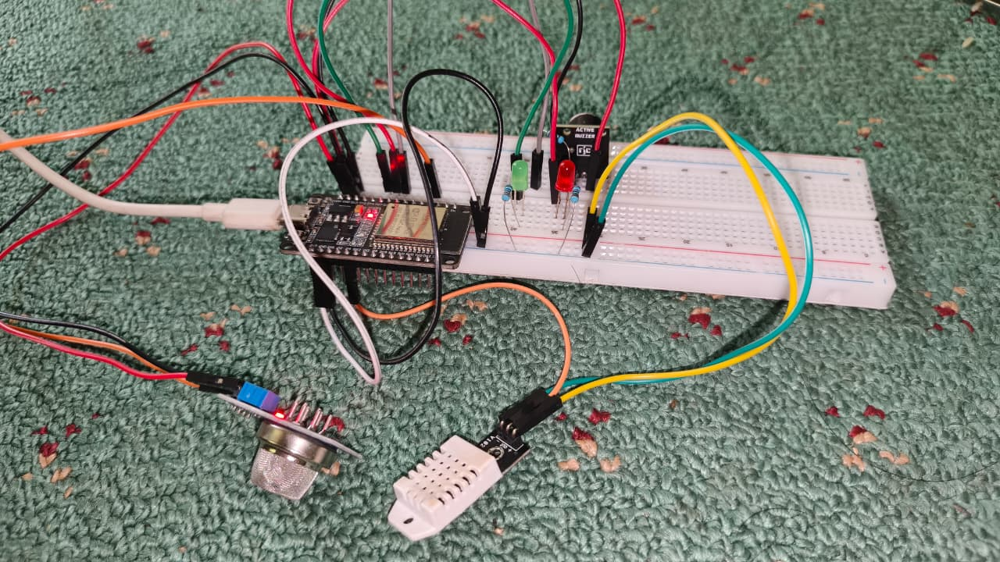
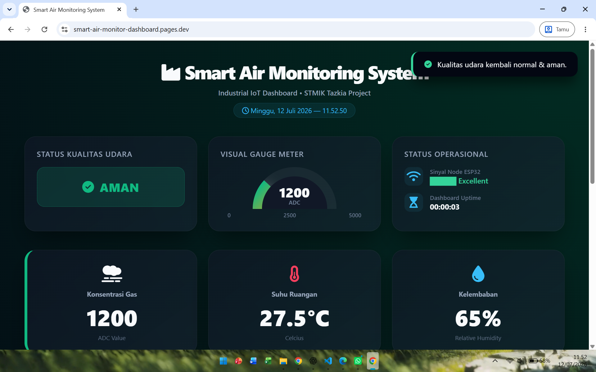
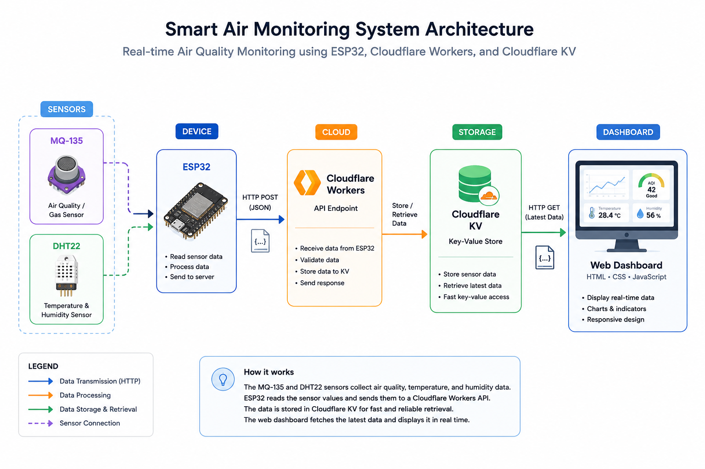

# 🌱 Smart Air Monitoring System

An IoT-based real-time air quality, temperature, and humidity monitoring system using ESP32 and cloud-based edge infrastructure.

[](https://smart-air-monitor-dashboard.pages.dev/)
[](https://github.com/Virnara/smart-air-monitoring)


---

## 📸 Project Preview

### Prototype Hardware


### Web Dashboard


---

## ✨ Overview
**Smart Air Monitoring System** is an IoT project designed to monitor ambient air quality and environmental conditions in real time. 

Using an ESP32 microcontroller, the system collects data from sensors, processes threshold logic locally to activate hardware alerts, and securely transmits structured JSON data to Cloudflare's serverless edge infrastructure. This project focuses on efficient network handling, memory-safe data processing, and proper hardware safety circuits.

---

## 🎯 Objectives
This project aims to:
- Monitor indoor air quality, smoke, and hazardous gas concentrations in real time.
- Measure ambient temperature and relative humidity levels accurately.
- Provide immediate visual (LED) and audible (Buzzer) indicators for safety conditions.
- Transmit sensor payload securely using lightweight HTTP POST to serverless edge functions.
- Present environmental states on an accessible, real-time web dashboard hosted at the edge.

---

## 🚀 Features
- **Real-Time Data Acquisition:** Continuous logging of air pollution levels alongside ambient temperature and humidity metrics.
- **Non-Blocking Timer Execution:** Uses `millis()` routines to manage sensor sampling, local alarms, and cloud transmission concurrently without freezing the code execution thread.
- **Emergency Cloud Trigger:** Instantly bypasses the standard 15-second update interval to push data to the cloud the exact moment gas levels cross the safety threshold.
- **Hardware Protection Circuit:** Utilizes a dedicated NPN transistor switch circuit to isolate the buzzer's inductive load and prevent microcontroller GPIO degradation.
- **Automatic WiFi Reconnection:** Native network state tracking that handles reconnection automatically if the local Wi-Fi connection drops.
- **Memory-Efficient String Formatting:** Uses `snprintf()` instead of dynamic String concatenation to prevent heap fragmentation and runtime memory leaks.

---

## 🛠 Hardware Components

| Component | Qty | Technical Specification / Usage |
| :--- | :---: | :--- |
| **ESP32 DevKit V1** | 1 | Main node controller with integrated Wi-Fi & Dual-Core SoC |
| **MQ-135 Sensor** | 1 | Air quality sensor (Smoke, Ammonia, Alcohol, Benzene, CO2) |
| **DHT22 Sensor** | 1 | High-accuracy digital temperature and humidity sensor |
| **Green LED** | 1 | Safe air quality status indicator |
| **Yellow LED** | 1 | Warning air quality status indicator |
| **Red LED** | 1 | Dangerous air quality status indicator |
| **Active Buzzer** | 1 | High-pitch audible safety alert signal |
| **2N2222 NPN Transistor** | 1 | Low-side saturation switch for buzzer isolation circuit |
| **Resistors (220 Ω)** | 3 | Current-limiting inline resistors for LED protection |
| **Resistor (1 kΩ)** | 1 | Base current resistor for transistor switching |
| **Breadboard & Jumper Wires** | 1 Set | Circuit prototyping and interconnects |

### Hardware Deep Dive

#### ESP32 DevKit V1
Serves as the main processing unit. It samples analog and digital inputs, runs local non-blocking safety routines, handles Wi-Fi state management, and dispatches JSON payloads over HTTPS.

#### MQ-135 Gas Sensor
Detects a wide spectrum of airborne gases including toxic fumes, smoke, and volatile organic compounds (VOCs). The continuous analog reading is sampled via the ESP32's ADC pin.

#### DHT22 Sensor
Provides high-precision ambient temperature and relative humidity readings over a single-wire digital interface.

#### Visual Indicators (LEDs)
- 🟢 **Green LED:** Safe ambient air conditions.
- 🟡 **Yellow LED:** Elevated gas concentration warning.
- 🔴 **Red LED:** Hazardous condition requiring immediate attention.

#### Active Buzzer & 2N2222 Transistor
To prevent pulling high currents directly from the ESP32 GPIO, the active buzzer is driven through a 2N2222 NPN transistor acting as a switch. This design guarantees microcontroller stability and protects internal silicon gates.

---

## 🔌 Wiring Diagram
Detailed schematic mapping out the connections between the ESP32, sensors, LEDs, and the transistor-driven buzzer circuit.


### Pin Assignment Matrix
| Component | Physical Pin | Target Node / GPIO | Technical Specification |
| :--- | :--- | :--- | :--- |
| **MQ-135 Gas** | Analog Out (AO) | `GPIO 34` | Routed via voltage divider step-down (~3.3V max input). |
| **DHT22 Sensor** | Data Pin | `GPIO 4` | Connected to 3.3V power rail; digital single-bus protocol. |
| **LED Green** | Anode (+) | `GPIO 27` | Protected by $220\text{ }\Omega$ inline current-limiting resistor. |
| **LED Red** | Anode (+) | `GPIO 26` | Protected by $220\text{ }\Omega$ inline current-limiting resistor. |
| **LED Yellow** | Anode (+) | `GPIO 14` | Protected by $220\text{ }\Omega$ inline current-limiting resistor. |
| **2N2222 BJT** | Base (B) | `GPIO 25` | Driven through $1\text{ k}\Omega$ resistor; acts as a low-side saturation switch. |
| **Active Buzzer** | Cathode (-) | Transistor Collector | Collector-Emitter loop acts as an isolated ground break. |

---

## ⚙️ Threshold Configuration

| Gas Level (ADC Value) | Air Quality Status | Green LED | Yellow LED | Red LED | Active Buzzer | Cloud Sync Interval |
| :---: | :---: | :---: | :---: | :---: | :---: | :---: |
| **0 – 1499** | 🟢 Safe | ON | OFF | OFF | Silent | 15 Seconds |
| **1500 – 2199** | 🟡 Warning | OFF | ON | OFF | Slow Pulsing Beep | 15 Seconds |
| **≥ 2200** | 🔴 Danger | OFF | OFF | ON | Continuous Alarm | **Instant Trigger** |

---

## 📡 System Architecture
The diagram below illustrates how sensor data flows from the embedded hardware to the cloud infrastructure and finally to the web dashboard.



---

## 🛠 Tech Stack Matrix

| Category | Technology / Tool | Specification / Usage |
| :--- | :--- | :--- |
| **Microcontroller** | ESP32 | Main Node Processor (Dual-Core SoC) |
| **Programming Language** | Arduino C++ | Embedded Firmware Architecture |
| **Development IDE** | Arduino IDE 2.x | Compilation and Deployment Environment |
| **Core Libraries** | `WiFi.h`, `HTTPClient.h`, `DHT.h` | Networking Stack and Sensor Drivers |
| **Cloud Infrastructure** | Cloudflare Workers | Serverless Gateway API HTTP POST Router |
| **Edge Database** | Cloudflare KV | High-speed Key-Value Engine for Latest State |
| **Front-End Dashboard** | HTML5, CSS3, JavaScript | Web Data Visualization Panel |
| **Web Hosting** | Cloudflare Pages | Static Front-End Application Cloud Hosting |

---

## 📦 Software & Tools Required

| Software / Tool | Recommended Version | Purpose |
| :--- | :---: | :--- |
| **Arduino IDE** | 2.x or higher | Firmware compilation and ESP32 uploading |
| **ESP32 Board Package** | Latest | Core framework support for Espressif hardware |
| **Wrangler CLI** | Latest | Deploying Cloudflare Workers and KV namespaces |
| **Git** | Latest | Version control management |
| **Modern Web Browser** | Latest | Viewing the real-time cloud dashboard |

---

## 📂 Project Structure
```text
smart-air-monitoring/
├── assets/
│   └── images/
│       ├── architecture.png
│       ├── preview.png
│       ├── prototype.jpg
│       └── wiring.png
├── src/
│   ├── cloudflare/
│   │   ├── schema.sql
│   │   └── worker.js
│   ├── esp32/
│   │   └── smart_air_monitor.ino
│   └── web-dashboard/
│       ├── index.html
│       ├── script.js
│       └── style.css
└── README.md

```

---

## 🛠️ Installation & Setup

### 1. Repository Setup

```bash
git clone [https://github.com/Virnara/smart-air-monitoring.git](https://github.com/Virnara/smart-air-monitoring.git)
cd smart-air-monitoring

```

### 2. Cloudflare Worker Deployment

1. Navigate to `src/cloudflare/`.
2. Login and deploy using Wrangler CLI:
```bash
npx wrangler login
npx wrangler deploy worker.js

```


3. Bind your **Cloudflare KV Namespace** to store incoming payload updates.

### 3. ESP32 Firmware Setup

1. Open `src/esp32/smart_air_monitor.ino` in **Arduino IDE**.
2. Install necessary libraries:
* `DHT sensor library` by Adafruit
* `Adafruit Unified Sensor`


3. Select **ESP32 Dev Module** under `Tools > Board`.
4. Update Wi-Fi and Cloud API parameters in code:
```cpp
const char* ssid = "YOUR_WIFI_SSID";
const char* password = "YOUR_WIFI_PASSWORD";
const char* serverPath = "[https://your-worker.workers.dev/api/data](https://your-worker.workers.dev/api/data)";

```


5. Compile and upload to your ESP32 board.

### 4. Dashboard Deployment

1. Deploy the contents of `src/web-dashboard/` directly to **Cloudflare Pages** or any static web host.
2. Ensure your `script.js` fetches data directly from your deployed Cloudflare Worker API endpoint.

---

## 🌐 Live Web Dashboard

The web dashboard provides real-time visualization of ambient environmental metrics directly served from edge storage.

👉 **[Access Live Dashboard Here](https://smart-air-monitor-dashboard.pages.dev/)**

---

## 🛣️ Roadmap & Future Enhancements

* [x] Real-time sensor sampling & non-blocking execution routines.
* [x] Edge-hosted serverless pipeline (Cloudflare Workers + KV).
* [x] Responsive client-side web monitoring interface.
* [ ] Persistent historical data logging using Cloudflare D1 / SQL database.
* [ ] Interactive time-series charts for historical temperature/gas trends.
* [ ] Telegram Bot integration for instant high-gas danger notifications.
* [ ] Cross-platform mobile companion app (Flutter).
* [ ] Predictive air-quality analytics model.

---

## 👨‍💻 Author

**Radel Virdiana**
*Web Developer • IoT Developer*

Building practical, modern digital solutions combining software systems and embedded hardware technology.

* 🌐 **Portfolio:** [virnara.github.io](https://virnara.github.io)
* 🐙 **GitHub:** [@Virnara](https://github.com/Virnara)
* 📺 **YouTube:** [@Virnara](https://youtube.com/@Virnara)

---

## 📄 License

This project is open-source and available under the [MIT License](https://www.google.com/search?q=LICENSE).

```

```
